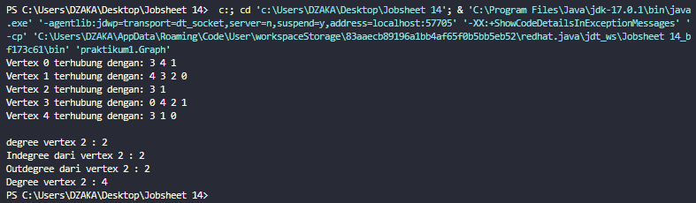
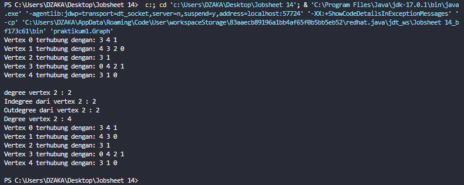
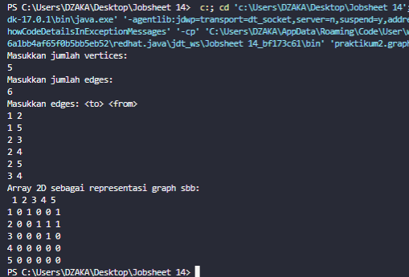
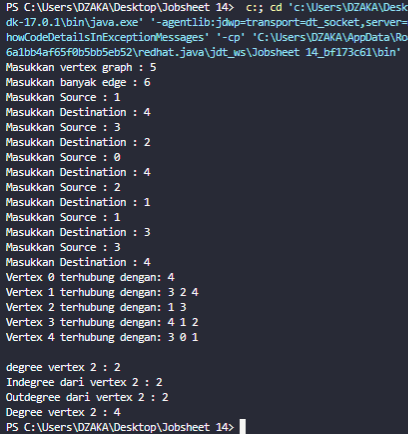
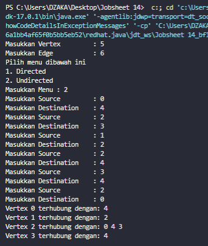

# JOBSHEET GRAPH
## Nama: Muhammad Dzaka Murran Rusid
## Kelas/Abs: 1F_D4-TI/18
#

### 1. Tujuan Praktikum
Setelah melakukan praktikum ini, mahasiswa mampu:

1. memahami model graph;
2. membuat dan mendeklarasikan struktur algoritma graph;
3. menerapkan algoritma dasar graph dalam beberapa studi kasus.
2. Praktikum

### 2.1 Implementasi Graph menggunakan Linked List

#### 2.1.1 Tahapan Percobaan
Waktu percobaan (30 menit)
Pada percobaan ini akan diimplementasikan Graph menggunakan Linked Lists untuk 
merepresentasikan graph adjacency. Silakan lakukan langkah-langkah praktikum sebagai berikut.
1. Buatlah class Node, dan class Linked Lists sesuai dengan praktikum Double Linked Lists.
Graph
vertex: int
LinkedList: List
right: Node
addEdge(source: int, destination: int): void
degree(source: int): void
removeEdge(source: int, destination: int): void
removeAllEdges()
printGraph()
2. Tambahkan class Graph yang akan menyimpan method-method dalam graph dan juga 
method main().
3. Di dalam class Graph, tambahkan atribut vertex bertipe integer dan list[] bertipe LinkedList.
4. Tambahkan konstruktor default untuk menginisialisasi variabel vertex dan menambahkan 
perulangan untuk jumlah vertex sesuai dengan jumlah length array yang telah ditentukan.
5. Tambahkan method addEdge(). Jika yang akan dibuat adalah graph berarah, maka yang
dijalankan hanya baris pertama saja. Jika graph tidak berarah yang dijalankan semua baris 
pada method addEdge().
6. Tambahkan method degree() untuk menampilkan jumlah derajat lintasan pada suatu vertex. 
Di dalam metode ini juga dibedakan manakah statement yang digunakan untuk graph berarah 
atau graph tidak berarah. Eksekusi hanya sesuai kebutuhan saja.
7. Tambahkan method removeEdge(). Method ini akan menghapus lintasan ada suatu graph. 
Oleh karena itu, dibutuhkan 2 parameter untuk menghapus lintasan yaitu source dan 
destination.
8. Tambahkan method removeAllEdges() untuk menghapus semua vertex yang ada di dalam 
graph.
9. Tambahkan method printGraph() untuk mencatak graph ter-update.
10. Compile dan jalankan method main() dalam class Graph untuk menambahkan beberapa edge 
pada graph, kemudian tampilkan. Setelah itu keluarkan hasilnya menggunakan pemanggilan 
method main(). Keterangan: degree harus disesuaikan dengan jenis graph yang telah dibuat 
(directed/undirected).
11. Amati hasil running tersebut.
12. Tambahkan pemanggilan method removeEdge() sesuai potongan code di bawah ini pada 
method main(). Kemudian tampilkan graph tersebut.
13. Amati hasil running tersebut.
14. Uji coba penghapusan lintasan yang lain! Amati hasilnya!

```java
package praktikum1;

public class Node {
    int data;
    Node prev, next;

    Node(Node prev, int data, Node next){
        this.prev=prev;
        this.data=data;
        this.next=next;
    }
}


```

```java
package praktikum1;

public class Graph {
    int vertex;
    LinkedList list[];

    public Graph(int vertex){
        this.vertex = vertex;
        list = new LinkedList[vertex];
        for(int i=0;i<vertex;i++){
            list[i] = new LinkedList();
        }
    }

    public void addEdge(int source, int destination){
        list[source].addFirst(destination);
        list[destination].addFirst(source);
    }

    public void degree(int source) throws Exception{
        System.out.println("degree vertex "+source +" : "+list[source].size());

        int k, totalIn=0, totalOut=0;
        for(int i=0;i<vertex;i++){
            for(int j=0;j<list[i].size();j++){
                if(list[i].get(j)==source)
                ++totalIn;
            }
        for(k=0;k<list[source].size();k++){
            list[source].get(k);
        }
        totalOut=k;
        }
        System.out.println("Indegree dari vertex "+source+" : "+totalIn);
        System.out.println("Outdegree dari vertex "+source+" : "+totalOut);
        System.out.println("Degree vertex "+source+" : "+(totalIn+totalOut));
    }

    public void removeEdge(int source, int destination) throws Exception{
        for(int i=0;i<vertex;i++){
            if(i==destination){
                list[source].remove(destination);
            }
        }
    }

    public void removeAllEdges(){
        for(int i=0;i<vertex;i++){
            list[i].clear();
        }
        System.out.println("Graph berhasil dikosongkan!");
    }

    public void printGraph() throws Exception{
        for (int i=0;i<vertex;i++){
            if(list[i].size()>0){
                System.out.print("Vertex " +i+ " terhubung dengan: ");
                for(int j=0;j<list[i].size();j++){
                    System.out.print(list[i].get(j) + " ");
                }
                System.out.println("");
            }
        }
        System.out.println(" ");
    }
    
    public static void main(String[] args) throws Exception{
        Graph graph = new Graph(6);
        graph.addEdge(0, 1);
        graph.addEdge(0, 4);
        graph.addEdge(1, 2);
        graph.addEdge(1, 3);
        graph.addEdge(1, 4);
        graph.addEdge(2, 3);
        graph.addEdge(3, 4);
        graph.addEdge(3, 0);
        graph.printGraph();
        graph.degree(2);
        graph.removeEdge(1, 2);
        graph.printGraph();
    }
}

```


```java
package praktikum1;

public class LinkedList {
    Node head;
    int size;

    public LinkedList(){
        head = null;
        size = 0;
    }

    public boolean isEmpty(){
        return head == null;
    }

    public void addFirst(int item){
        if(isEmpty()){
            head = new Node(null, item, null);
        }else{
            Node newNode = new Node(null, item, head);
            head.prev = newNode;
            head = newNode;
        }
        size++;
    }

    public void addLast(int item){
        if(isEmpty()){
            addFirst(item);
        }else{
            Node current = head;
            while (current.next != null){
                current = current.next;
            }
            Node newNode = new Node(current, item, null);
            current.next = newNode;
            size++;
        }
    }

    public void add(int item, int index) throws Exception{
        if(isEmpty()){
            addFirst(item);
        }else if(index<0 || index > size){
            throw new Exception("Nilai indeks di luar batas");
        }else{
            Node current = head;
            int i = 0;
            while (i<index){
                current = current.next;
                i++;
            }
            if(current.prev == null){
                Node newNode = new Node(null, item, current);
                current.prev = newNode;
                head = newNode;
            }else{
                Node newNode = new Node(current.prev, item, current);
                newNode.prev = current.prev;
                newNode.next = current;
                current.prev.next = newNode;
                current.prev = newNode;
            }
        }
        size++;
    }

    public int size(){
        return size;
    }

    public void clear(){
        head = null;
        size = 0;
    }

    public void print(){
        if(!isEmpty()){
            Node tmp = head;
            while(tmp != null){
                System.out.print(tmp.data + "\t");
                tmp = tmp.next;
            }
            System.out.println("\nberhasil diisi");
        }else{
            System.out.println("Linked List Kosong");
        }
    }

    public void removeFirst() throws Exception{
        if(isEmpty()){
            throw new Exception("Linked List masih kosong, tidak dapat dihapus");
        }else if(size == 1){
            removeLast();
        }else{
            head = head.next;
            head.prev = null;
            size--;
        }
    }

    public void removeLast() throws Exception{
        if(isEmpty()){
            throw new Exception("Linked List masih kosong, tidak dapat dihapus!");
        }else if(head.next == null){
            head = null;
            size--;
            return;
        }
        Node current = head;
        while(current.next.next != null){
            current = current.next;
        }
        current.next = null;
        size--;
    }

    public void remove(int index) throws Exception{
        if(isEmpty() || index>=size){
            throw new Exception("Nilai indeks di luar batas");
        }else if(index==0){
            removeFirst();
        }else{
            Node current = head;
            int i = 0;
            while(i<index){
                current = current.next;
                i++;
            }
            if(current.next == null){
                current.prev.next = null;
            }else if(current.prev == null){
                current = current.next;
                current.prev = null;
                head = current;
            }else{
                current.prev.next = current.next;
                current.next.prev = current.prev;
            }
            size--;
        }
    }

    public int getFirst() throws Exception{
        if(isEmpty()){
            throw new Exception("Linked List kosong");
        }
        return head.data;
    }

    public int getLast() throws Exception{
        if(isEmpty()){
            throw new Exception("Linked List Kosong");
        }
        Node tmp = head;
        while (tmp.next != null){
            tmp = tmp.next;
        }
        return tmp.data;
    }

    public int get(int index) throws Exception{
        if(isEmpty() || index>=size){
            throw new Exception("Nilai indeks di luar batas");
        }
        Node tmp = head;
        for(int i=0;i<index;i++){
            tmp = tmp.next;
        }
        return tmp.data;
    }

}


```


#### 2.1.2 Verifikasi Hasil Percobaan



<br>



#### 2.1.3 Pertanyaan Percobaan
1. Sebutkan beberapa jenis (minimal 3) algoritma yang menggunakan dasar Graph, dan apakah 
kegunaan algoritma-algoritma tersebut?

**Jawaban:**

**-Algoritma Prim, kegunaannya adalah mencari pohon rentang minimum untuk sebuah graf berbobot yang terhubung. Ini berarti menemukan subset dari tepi yang membentuk sebuah pohon yang mencakup etiap titik, di mana berat total semua tepi di pohon diminimalkan. Jika grafik tidak terhubung, maka ia menemukan hutan rentang minimum (pohon rentang minimum untuk setiap komponen terhubung).**

**-Algoritma Dijkstra, kegunaannya adalah dipakai dalam memecahkan permasalahan jarak terpendek (shortest path problem) untuk sebuah graf berarah (directed graph)**

**-Algoritma Warshall , kegunaannya menghitung jarak terpendek (shortest path) untuk semua pasangan titik pada sebuah graph, dan melakukannya dalam waktu berorde kubik. Algoritma warshall digunakan untuk menyelesaikan permasalahan jalur terpendek multi path**

2. Pada class Graph terdapat array bertipe LinkedList, yaitu LinkedList list[]. Apakah tujuan 
pembuatan variabel tersebut ? 

**Jawaban: Variabel tersebut berfungsi untuk di Untuk memanggil fungsi linked list dan mengisi list yang berupa vertex pada linked list tersebut.**

3. Apakah alasan pemanggilan method addFirst() untuk menambahkan data, bukan method add 
jenis lain pada linked list ketika digunakan pada method addEdge pada class Graph?

**Jawaban: Untuk mengenalkan vertex tersebut dan koneksinya**

4. Bagaimana cara mendeteksi prev pointer pada saat akan melakukan penghapusan suatu edge 
pada graph ?

**Jawaban: dengan cara ketika i == destination maka akan dilihat source dari i atau dengan cara melakukan looping vertex.**

5. Kenapa pada praktikum 2.1.1 langkah ke-12 untuk menghapus path yang bukan merupakan 
lintasan pertama kali menghasilkan output yang salah ? Bagaimana solusinya ?

**Jawaban: Output potongan program diatas tidak ada yang eror, akan tetapi vertex yang dilewati mengalami perubahan lintasan**

### 2.2 Implementasi Graph menggunakan Matriks
Kegiatan praktikum 2 merupakan implementasi Graph dengan Matriks. Silakan lakukan langkahlangkah percobaan praktikum berikut ini, kemudian verifikasi hasilnya. Setelah itu jawablah pertanyaan terkait percobaan yang telah Anda lakukan.

#### 2.2.1 Tahapan Percobaan
Waktu percobaan: 30 menit
Pada praktikum 2.2 ini akan diimplementasikan Graph menggunakan matriks untuk 
merepresentasikan graph adjacency. Silakan lakukan langkah-langkah praktikum sebagai berikut.
1. Uji coba graph bagian 2.2 menggunakan array 2 dimensi sebagai representasi graph. Buatlah class 
graphArray yang didalamnya terdapat variabel vertices dan array twoD_array!
2. Buatlah konstruktor graphArray sebagai berikut!
3. Untuk membuat suatu lintasan maka dibuat method makeEdge() sebagai berikut.
Untuk menampilkan suatu lintasan diperlukan pembuatan method getEdge() berikut.
4. Kemudian buatlah method main() seperti berikut ini.
5. Jalankan class graphArray dan amati hasilnya!

```java
package praktikum2;

import java.util.Scanner;
public class graphArray {
    private final int vertices;
    private final int[][] twoD_array;

    public graphArray(int v){
        vertices = v;
        twoD_array = new int[vertices+1][vertices+1];
    }

    public void makeEdge(int to, int from, int edge){
        try{
            twoD_array[to][from] = edge;
        }catch(ArrayIndexOutOfBoundsException index){
            System.out.println("Vertex tidak ada);");
        }
    }

    public int getEdge(int to, int from){
        try{
            return twoD_array[to][from];
        }catch (ArrayIndexOutOfBoundsException index){
            System.out.println("Vertex tidak ada");
        }
        return -1;
    }

    public static void main(String args[]){
        int v, e, count = 1, to = 0, from = 0;
        Scanner sc = new Scanner(System.in);
        graphArray graph;
        try{
            System.out.println("Masukkan jumlah vertices: ");
            v = sc.nextInt();
            System.out.println("Masukkan jumlah edges: ");
            e = sc.nextInt();

            graph = new graphArray(v);

            System.out.println("Masukkan edges: <to> <from>");
            while (count <= e){
                to = sc.nextInt();
                from = sc.nextInt();

                graph.makeEdge(to, from, 1);
                count++;
            }
            System.out.println("Array 2D sebagai representasi graph sbb: ");
            System.out.print(" ");
            for(int i=1;i<=v;i++){
                System.out.print(i + " ");
            }
            System.out.println();

            for(int i = 1;i<=v;i++){
                System.out.print(i + " ");
                for(int j = 1;j<=v;j++){
                    System.out.print(graph.getEdge(i, j)+ " ");
                }
                System.out.println();
            }
        }catch(Exception E){
            System.out.println("Error, silahkan cek kembali!\n" + E.getMessage());
        }
        sc.close();
    }
}
```


#### 2.2.2 Verifikasi Hasil Percobaan



#### 2.2.3 Pertanyaan Percobaan
1. Apakah perbedaan degree/derajat pada directed dan undirected graph?

**Jawaban: Pada directed graph degree / derajat tidak selalu berhubungan kembali sedangkan pada undirected graph degree/derajat pasti berhubungan**

2. Pada implementasi graph menggunakan adjacency matriks. Kenapa jumlah vertices harus 
ditambahkan dengan 1 pada indeks array berikut?

**Jawaban: karena menggunakan array dan dimulai dari 0, maka harus perlu ditambah dengan 1**

3. Apakah kegunaan method getEdge() ?

**Jawaban: getEdge berfungsi untuk menampilkan suatu lintasan yang diperlukan**

4. Termasuk jenis graph apakah uji coba pada praktikum 2.2?

**Jawaban: jenis graph diatas adalah "Directed graph" karena 1 berhubungan dengan 2 akan tetapi 2 tidak berhubungan dengan 1**

5. Mengapa pada method main harus menggunakan try-catch Exception ?

**Jawaban: Agar saat terjadi eror, eksekusi program dapat terus berjalan tanpa memberhentikan program sehingga meminimalisir terjadinya eror atau output tidak muncul**


### 3. Tugas Praktikum
1. Ubahlah lintasan pada praktikum 2.1 menjadi inputan!

```java
package Tugas;

import java.util.Scanner;
public class Graph {
    static int vertex;
    static LinkedList list[];

    public Graph(int vertex){
        this.vertex = vertex;
        list = new LinkedList[vertex];
        for(int i=0;i<vertex;i++){
            list[i] = new LinkedList();
        }
    }

    public static void addEdge(int source, int destination){
        list[source].addFirst(destination);
        list[destination].addFirst(source);
    }

    public static void degree(int source) throws Exception{
        System.out.println("degree vertex "+source +" : "+list[source].size());

        int k, totalIn=0, totalOut=0;
        for(int i=0;i<vertex;i++){
            for(int j=0;j<list[i].size();j++){
                if(list[i].get(j)==source)
                ++totalIn;
            }
        for(k=0;k<list[source].size();k++){
            list[source].get(k);
        }
        totalOut=k;
        }
        System.out.println("Indegree dari vertex "+source+" : "+totalIn);
        System.out.println("Outdegree dari vertex "+source+" : "+totalOut);
        System.out.println("Degree vertex "+source+" : "+(totalIn+totalOut));
    }

    public static void removeEdge(int source, int destination) throws Exception{
        for(int i=0;i<vertex;i++){
            if(i==destination){
                list[source].remove(destination);
            }
        }
    }

    public void removeAllEdges(){
        for(int i=0;i<vertex;i++){
            list[i].clear();
        }
        System.out.println("Graph berhasil dikosongkan!");
    }

    public static void printGraph() throws Exception{
        for (int i=0;i<vertex;i++){
            if(list[i].size()>0){
                System.out.print("Vertex " +i+ " terhubung dengan: ");
                for(int j=0;j<list[i].size();j++){
                    System.out.print(list[i].get(j) + " ");
                }
                System.out.println("");
            }
        }
        System.out.println(" ");
    }
    
    public static void main (String[] args) throws Exception {
        Scanner sc = new Scanner(System.in);
        System.out.print("Masukkan vertex graph : ");
        int v = sc.nextInt();
        Graph G = new Graph(v);
        System.out.print("Masukkan banyak edge : ");
        int e = sc.nextInt();
        for (int i = 0; i < e; i++) {
            System.out.print("Masukkan Source : ");
            int source = sc.nextInt();
            System.out.print("Masukkan Destination : ");
            int des = sc.nextInt();

            G.addEdge(source, des);

        }
        G.printGraph();
        Graph.addEdge(0, 1);
        Graph.addEdge(0, 4);
        Graph.addEdge(1, 2);
        Graph.addEdge(1, 3);
        Graph.addEdge(1, 4);
        Graph.addEdge(2, 3);
        Graph.addEdge(3, 4);
        Graph.addEdge(3, 0);
        Graph.removeEdge(1, 2);
        Graph.printGraph();
        Graph.degree(2);
    
    }
}
```
OUTPUT




2. Tambahkan method graphType dengan tipe boolean yang akan membedakan graph termasuk 
directed atau undirected graph. Kemudian update seluruh method yang berelasi dengan method 
graphType tersebut (hanya menjalankan statement sesuai dengan jenis graph) pada praktikum 
2.1

```java
public boolean graphType(int source, int destination) throws Exception{
    list[source].addFirst(destination);
    return true;
}
```

OUTPUT:



3. Modifikasi method removeEdge() pada praktikum 2.1 agar tidak menghasilkan output yang salah 

```java
public void removeEdge(int source, int destination) throws Exception {
        for (int i = 0; i< vertex; i++) {
            if (i == destination) {
                list[source].remove(destination);
            }
        }
    }
```

untuk path selain path pertama kali!

OUTPUT: Output tidak ada dikarenakan error. 

4. Ubahlah tipe data vertex pada seluruh graph pada praktikum 2.1 dan 2.2 dari Integer menjadi tipe generic agar dapat menerima semua tipe data dasar Java! Misalnya setiap vertex yang awalnya berupa angka 0,1,2,3, dst. selanjutnya ubah menjadi suatu nama daerah seperti Gresik, Bandung, Yogya, Malang, dst.

```java
public void printGraph() throws Exception {
        String namKota = "";
        for (int i = 0; i < vertex; i++) {
            if (list[i].size() > 0) {
                if (i == 0) {
                    namKota = "Malang";
                } else if (i == 1) {
                    namKota = "Surabaya";
                } else if (i == 2) {
                    namKota = "Gresik";
                } else if (i == 3) {
                    namKota = "Pandaan";
                } else if (i == 4) {
                    namKota = "Bandung";
                } else {
                    namKota = "Jakarta";
                }
                System.out.print("Vertex " + namKota + " terhubung dengan: ");
                for (int j = 0; j < list[i].size(); j++) {
                    System.out.print(list[i].get(j) + " ");
                }
                System.out.println("");
            }
        }
        System.out.println(" ");
    }
```


